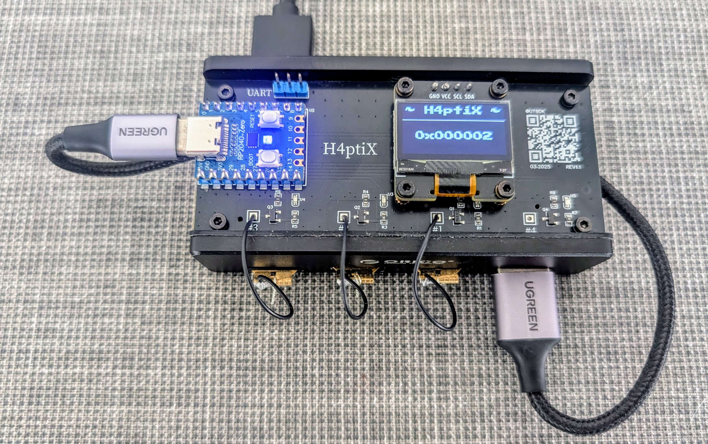

## H4ptiX

The **H4ptiX** is a hardware/software solution designed to simulate physical interactions with **YubiKey** during automated testing. This device allows test frameworks to programmatically "touch" the YubiKey, enabling end-to-end (E2E) testing of multi-factor authentication (MFA) flows without manual intervention.

Port about (in Russian): https://ut.buglloc.com/2025/04/h4ptix/

#### Key Features
- **Physical YubiKey Interaction**: A capacitive touch mechanism triggers the YubiKey sensor as if pressed by a user.
- **Programmable Control**: Integrates with test frameworks to simulate button presses on demand.
- **Multi-Device Support**: Works with various YubiKey models, but I've used [Yubikey nano 5](https://www.yubico.com/th/product/yubikey-5-series/yubikey-5-nano/)
- **Test Automation Integration**: Compatible with CI/CD pipelines for unattended MFA/PIV/FIDO2 testing.

#### Use Cases
- Automated testing of **WebAuthn**, **U2F**, **TOTP**, and **OTP-based authentication**.
- CI/CD pipelines requiring **MFA testing** without human intervention.
- Load testing scenarios involving **YubiKey hardware authentication**.

#### Hardware Implementation
TL;DR:
  - [Waveshare RP2040-Zero](https://www.waveshare.com/wiki/RP2040-Zero) (Raspberry Pi RP2040, USB-C, compact footprint)
  - [USB Hub: ORICO 4-Port USB 3.0](https://oricotechs.com/th/products/orico-4-port-usb-3-0-clamp-design-mountable-hub)
  - WeAct 0.96 Inch OLED IIC
  - Low output capacitance transistors

Schematic, PCB, etc: [OSHWLab](https://oshwlab.com/buglloc/h4ptix)

#### Build
You can build the [firmware](firmware) yourself or download prebuilded from releases.
Available builds:
  - `h4ptix_rp2040_lonely.u2f` - lonely board for signle YubiKey
  - `h4ptix_rp2040_basic.u2f` - basic board w/o display for 4 YubiKeys
  - `h4ptix_rp2040_display.u2f` - basic + display for 4 YubiKeys

#### Benefits
  - **Eliminates manual MFA steps** in automated tests.
  - **Improves test coverage** for security-critical flows.
  - **Reduces flakiness** compared to software emulators.
  - **Cost-effective** compared to commercial  automation tools.
